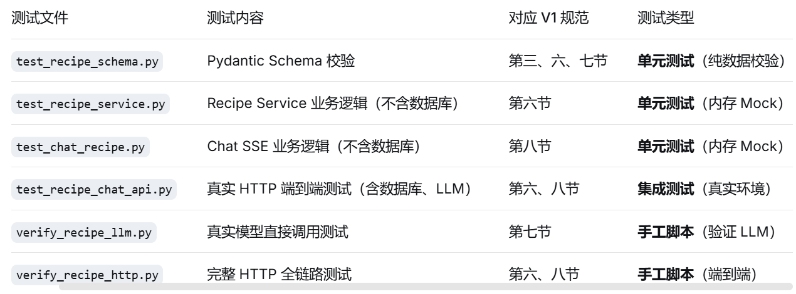

# 当前阶段和测试文档

## 当前阶段

目前处于“功能实现完成、真实主链路验证通过、具备提交与联调条件”的阶段。

当前运行状态：

- 后端：`http://127.0.0.1:8888`，正在运行
- PostgreSQL：健康，端口 5432
- Redis：健康，端口 6379
- MinIO：健康，端口 9000/9001
- 数据库迁移：`17f47c61a21b (head)`
- Git：本次改动按数据库、菜谱、对话、测试、容器和文档分类提交
- `.env` 已被 Git 忽略，密钥未进入待提交文件

## 已完成的工作

### 1. Recipe 模块

- 实现 `POST /api/recipes`（菜谱生成）
- 实现 `GET /api/recipes/{recipe_id}`（菜谱查询）
- 读取当前用户的已确认食材
- 未确认食材返回 422
- 菜谱不存在返回 404
- 访问他人菜谱返回 403
- LLM 无法使用返回 503
- 保存完整结构化菜谱
- 首次生成 `version=1`
- 保存真实 `provider/model/is_mock`
- 固定营养免责声明

### 2. Chat 与 SSE

- 实现 `POST /api/chat/sessions`（chat会话）
- 实现 `POST /api/chat/sessions/{session_id}/messages`（chat消息，SSE）
- 创建会话只接收 `recipe_id`
- 消息只接收 `content`
- 普通问答不修改版本
- 修改菜谱时保存完整新版本并 `version + 1`
- SSE 仅保留：
  - `token`
  - `recipe_updated`
  - `done`
  - `error`
- 已移除 `tool_call` 和 `tool_result`

### 3. 最小 LangGraph

首次生成流程：

```
load_confirmed_ingredients
→ generate_recipe
→ validate_and_save
```

对话流程：

```
load_recipe_context
→ call_llm
→ answer / update_recipe
```

没有增加 Supervisor、工具编排或知识库。

### 4. 真实模型

- 实现 Fake/Real 双模式

- 使用 OpenAI-compatible 接口

- 已使用 `Qwen/Qwen3.6-35B-A3B` 实测

- 真实模式失败时不会自动回退 Fake

- Recipe 和 Chat 输出均经过 Pydantic 严格校验

- 修复了模型最初返回中文字段名的问题，在 Prompt 中加入精确 JSON Schema

- 本地 `.env` 已设置：

  - `LLM_MODE=real`
  - `LLM_TIMEOUT_SECONDS=60`

### 5. PostgreSQL 与迁移

新增：

- `food_recognition_tasks`
- `recipes`
- `chat_sessions.recipe_id`

完整 Alembic 链已经在空 PostgreSQL 数据库中成功升级到 head。

### 6. 真实 HTTP 全链路

已经实际完成：

```
注册
→ 登录
→ JWT 鉴权
→ 模拟已确认食材
→ 真实模型生成菜谱
→ 查询菜谱
→ 普通问答
→ 修改为三人份并少放油
→ 再次查询新版本
```

真实结果：

```
{
  "recipe_status": 201,
  "query_status": 200,
  "generator": {
    "provider": "openai_compatible",
    "model": "Qwen/Qwen3.6-35B-A3B",
    "is_mock": false
  },
  "answer_events": ["token", "done"],
  "update_events": ["token", "recipe_updated", "done"],
  "initial_version": 1,
  "final_version": 2,
  "final_servings": 3
}
```

### 7. 测试文件清单



- `tests/test_recipe_schema.py`
- `tests/test_recipe_service.py`
- `tests/test_chat_recipe.py`
- `tests/test_recipe_chat_api.py`
- `scripts/verify_recipe_llm.py`
- `scripts/verify_recipe_http.py`

## 测试文档（除了docker以外所有测试都已通过）

### 一、单元测试

进入后端：

```
cd D:\ByteCreek\mycodes\xjtu-visagent2026--\backend
```

运行本次测试：

```
uv run pytest -q tests/test_recipe_schema.py tests/test_recipe_service.py tests/test_chat_recipe.py tests/test_recipe_chat_api.py
```

预期：

```
15 passed
```

运行代码检查：

```
uv run ruff check app/api/recipes.py app/api/chat.py app/entity/recipe_schema.py app/services/agent_graph.py app/services/llm_gateway.py app/services/recipe_service.py app/services/chat_service.py
```

### 二、检查数据库和容器

```
docker ps
uv run alembic current
```

预期看到：

```
visagent-postgres   healthy
visagent-redis      healthy
visagent-minio      healthy
17f47c61a21b (head)
```

如容器停止：

```
docker start visagent-postgres visagent-redis visagent-minio
```

### 三、真实模型脚本测试（验证 LLM 调用）

```
uv run python scripts/verify_recipe_llm.py
```

它会真实调用模型，验证：

- 两人份菜谱生成
- JSON 结构校验
- 修改为三人份
- `generator.is_mock=false`

### 四、完整 HTTP 测试

后端当前正在运行。若以后停止了，重新启动：

```
uv run uvicorn main:app --host 127.0.0.1 --port 8888
```

另开终端执行：

```
uv run python scripts/verify_recipe_http.py
```

该脚本会：

- 创建临时本地测试用户
- 登录并获取 JWT
- 模拟插入确认食材
- 调用真实 Recipe API
- 测试普通问答 SSE
- 测试修改菜谱 SSE
- 检查版本从 1 升到 2

这个脚本会调用老师的模型约三次，并在本地数据库中留下临时验证数据。

### 五、浏览 API

打开：

- [Swagger API 文档](http://127.0.0.1:8888/docs)
- [健康检查](http://127.0.0.1:8888/api/health)
- [MinIO 控制台](http://127.0.0.1:9001/)

### 六、全量回归

```
uv run pytest -q
```

当前基准是：

```
108 passed, 11 failed
```

因此测试时重点看 Recipe/Chat 的 15 项是否继续全绿，不要把现有 Dashboard/Training 的 11 项失败误判成本次回归。

### 七、Docker 镜像构建失败，先终止了
